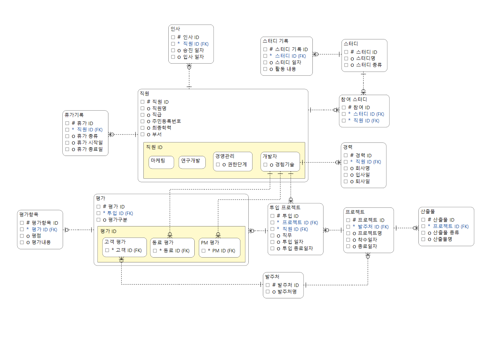

# DB Design Project

데이터베이스설계 팀프로젝트 — CMM(사원 관리 시스템)

## 기술 스택

- **DB**: MySQL 8.0
- **Backend**: Java (JDBC)
- **GUI**: Java Swing
- **Web**: JSP

## 데이터베이스 설정

- DB명: `cmm`
- Host: `localhost:3306`
- User: `ureca` / PW: `ureca`

스키마 및 초기 데이터는 `export/` 폴더의 SQL 파일을 사용하세요.

```sql
-- DDL (테이블 생성)
source export/CMM_DDL.sql

-- DML (초기 데이터)
source export/CMM_DML.sql
```

## ERD



## 주요 테이블

| 테이블 | 설명 |
|--------|------|
| employee | 사원 기본 정보 |
| developer | 개발자 정보 |
| career | 사원 경력 |
| hr_record | 인사 기록 |
| leave | 휴가 신청 |
| project | 프로젝트 |
| project_participation | 프로젝트 참여 |
| output | 프로젝트 산출물 |
| study | 스터디 |
| study_participation | 스터디 참여 |
| study_activity_history | 스터디 활동 이력 |
| evaluation | 평가 |
| evaluation_item | 평가 항목 |
| pm_evaluation | PM 평가 |
| customer_evaluation | 고객 평가 |
| partner_evaluation | 동료 평가 |
| management | 관리 정보 |
| customer | 고객사 |

## 프로젝트 구조

```
src/
├── main/java/com/example/
│   ├── dao/          # JDBC DAO 클래스
│   ├── model/        # 엔티티 모델 클래스
│   └── swing/        # Swing GUI
│       ├── Main.java
│       ├── MainFrame.java
│       ├── panel/    # 테이블별 패널
│       └── dialog/   # 입력 다이얼로그
└── webapp/           # JSP 웹 페이지
    ├── employee/
    ├── leave/
    ├── project/
    └── study/

export/               # DB 스키마 및 산출물
├── CMM_DDL.sql
├── CMM_DML.sql
└── CMM.png

```

## 실행 방법

1. MySQL에서 `cmm` 데이터베이스 생성 후 DDL/DML 실행
2. IntelliJ IDEA에서 프로젝트 열기
3. `mysql-connector-j` JAR을 classpath에 추가
4. `com.example.swing.Main` 실행


## Git Workflow & Convention

### 1. 브랜치 전략
- 모든 작업은 Issue를 기반으로 하며, 브랜치명은 이슈 번호를 접두어로 사용합니다.
- 구조: `feature/#{이슈번호}` (예: `feature/#5-login-api`)

### 2. 작업 프로세스 (Issue + PR)
1. **Issue 발행**: 구현할 기능이나 수정할 버그에 대해 이슈를 생성하고 번호를 할당받습니다.
2. **브랜치 생성**: 할당된 이슈 번호를 사용하여 로컬 브랜치를 생성합니다.
3. **Draft PR 생성**: 작업을 시작하면서 GitHub에 **Draft Pull Request**를 생성하여 작업 현황을 공유합니다.
4. **리뷰 및 머지**: 작업이 완료되면 Draft 상태를 해제하고 팀원들의 리뷰를 거친 후 `main` 브랜치에 머지합니다.

### 3. 커밋 메시지 가이드
- `feat #이슈번호: 요약 내용` 형식으로 작성하여 이슈와 커밋을 연동합니다.
